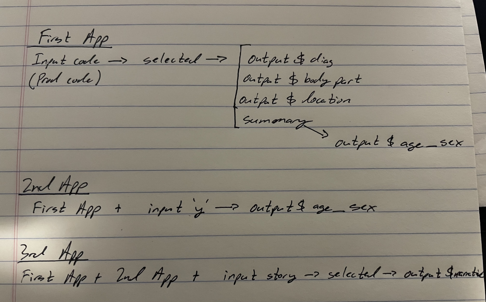

# Question 1



# Question 2

```{r eval = FALSE}
injuries %>%
  mutate(diag = fct_lump(fct_infreq(diag, n = 5))) %>%
  group_by(diag) %>%
  summarise(n = as.integer(sum(weight)))
```

The original code above groups the diagnosis factors largest to smallest up to 
the nth factor (in this case n = 5) with the "other or not stated" factor
being first. After the nth factor, everything else is lumped into "other."

If we switch the two functions, we first see that "other" is now listed first 
and while the list is technically in descending order, it is somewhat misleading
because it first lumped factors past n = 5 into the "other" category and then
listed the top 5.

```{r eval = FALSE}
injuries %>%
  mutate(diag = fct_infreq(fct_lump(diag, n = 5))) %>%
  group_by(diag) %>%
  summarise(n = as.integer(sum(weight)))
```


# Question 3

```{r eval = FALSE}
  # Orignal front and back end from chapter
  fluidRow(
    column(4, tableOutput("diag")),
    column(4, tableOutput("body_part")),
    column(4, tableOutput("location"))
    
  output$diag <- renderTable(count_top(selected(), diag), width = "100%")
  output$body_part <- renderTable(count_top(selected(), body_part), width = "100%")
  output$location <- renderTable(count_top(selected(), location), width = "100%")
```

The above code is from the original in chapter 4. The three table outputs 
produce static tables. If we change this to dataTableOutput on the front end and
also adjust the back end we can give drop down options for the user to see. 
Below you can see the front end code chunk as well as the changed back end.

```{r eval = FALSE}
# Front end changed to allow drop down
  fluidRow(
        column(4, dataTableOutput("diag")),
        column(4, dataTableOutput("body_part")),
        column(4, dataTableOutput("location"))
# Back end to produce the drop down options        
    output$diag <- renderDataTable(count_top(selected(), diag), options = list(pageLength = 5))
    output$body_part <- renderDataTable(count_top(selected(), body_part), options = list(pageLength = 5))
    output$location <- renderDataTable(count_top(selected(), location), options = list(pageLength = 5))
```


# Question 4

I'm not quite sure on this. I know we would need to add 2 action buttons using
something like "forward" and "back". We could possibly group them by factor or 
alphabetical and then serve those in eventReactive like we discussed in chapter 3. 


